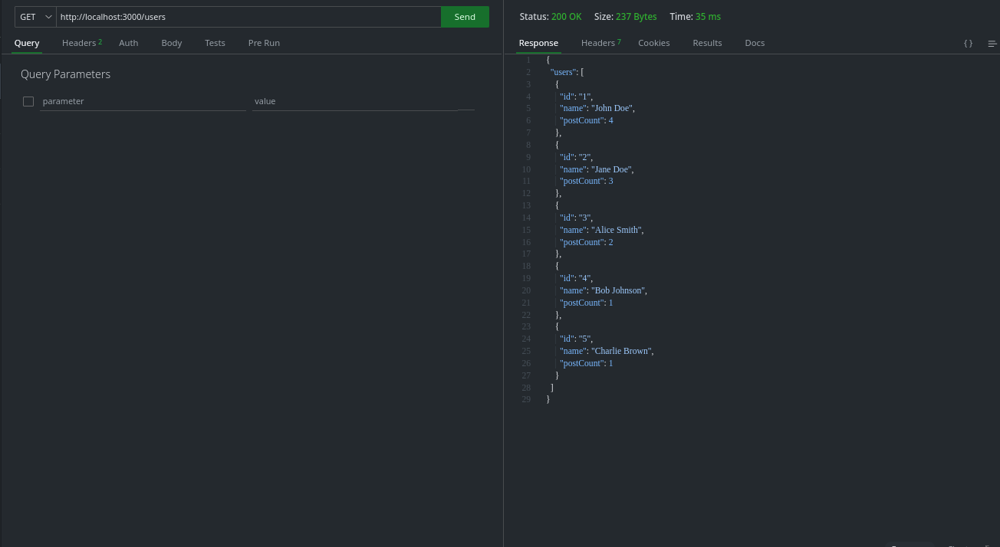

# Social Media Analytics Microservice

A lightweight microservice for fetching and analyzing social media data.

## Backend (Q1)

Handles API requests and data processing efficiently.

## Frontend (Q2)

Simple UI to display analytics data.

## API Endpoints

### 1. Top Users

- **Route:** `/top-users`
- **Description:** Fetches the top five users with the highest number of posts.
  

### 2. Latest Posts

- **Route:** `/posts?type=latest`
- **Description:** Displays the latest five posts in real-time.
  

### 3. Popular Posts

- **Route:** `/posts?type=popular`
- **Description:** Fetches the post(s) with the highest number of comments.
  
